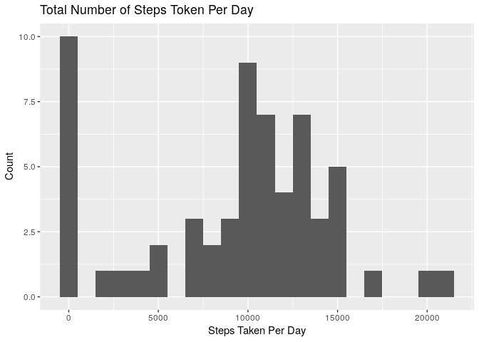
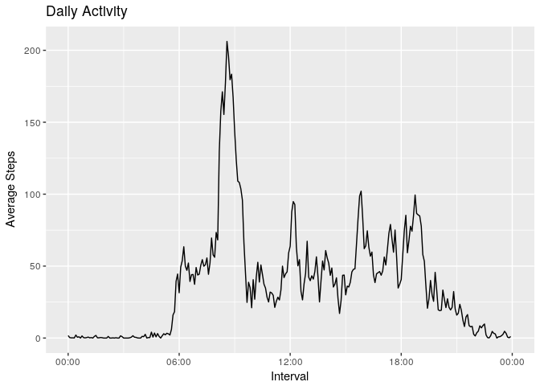
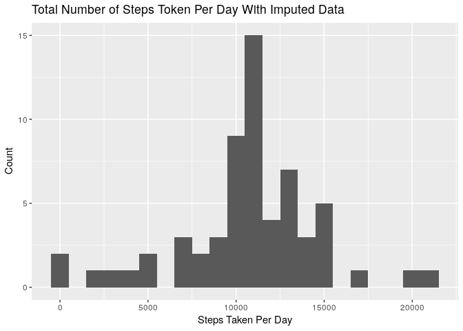
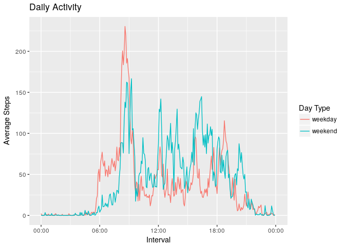

# Reproducible Research: Peer Assessment 1


## Loading and preprocessing the data

Load libraries.

```r
library(dplyr)
library(lubridate)
library(ggplot2)
```

Load data and convert field 'date' to date.

```r
activity <- read.csv('activity.csv') %>% 
  tbl_df %>%
  mutate(date=ymd(date))
```

## What is mean total number of steps taken per day?

Aggregate steps by date.

```r
activity.perday <- activity %>% 
  group_by(date) %>% 
  summarise(total.steps=sum(steps, na.rm=TRUE))
```

Plot histogram with bin width 1000.

```r
ggplot(aes(total.steps), data=activity.perday) +
  geom_histogram(binwidth = 1000) +
  labs(x='Steps Taken Per Day', y='Count', title='Total Number of Steps Token Per Day')
```

<!-- -->

Calculate mean and median for daily total steps.

```r
mean(activity.perday$total.steps)
```

```
## [1] 9354.23
```

```r
median(activity.perday$total.steps)
```

```
## [1] 10395
```
## What is the average daily activity pattern?

Aggregate by interval

```r
activity.daily <- activity %>% 
  group_by(interval) %>%
  summarise(average.steps=mean(steps, na.rm=TRUE))
```

Plot daily activity. As display the x lab as factor is a bit too overwhelming, Interval identifier has been converted into pseudo timestamps.

```r
activity.daily <- activity.daily %>%
  mutate(time=ymd_hm(sprintf('20170101%04d', interval)))

ggplot(data=activity.daily, aes(x=time, y=average.steps)) +
  geom_line() +
  labs(x="Interval", y="Average Steps", title='Daily Activity') +
  scale_x_datetime(limits=c(ymd_hm('2017-01-01 00:00'), ymd_hm('2017-01-01 23:59')) ,date_labels="%H:%M")
```

<!-- -->

Maximum activity interval of day.

```r
(activity.daily %>% select(interval, average.steps))[which.max(activity.daily$average.steps),] 
```

```
## # A tibble: 1 × 2
##   interval average.steps
##      <int>         <dbl>
## 1      835      206.1698
```

## Imputing missing values

Number of missing rows

```r
sum(is.na(activity$steps))
```

```
## [1] 2304
```

Impute missing values with mean of the interval.

```r
activity.imputed <- activity %>% 
  group_by(interval) %>% 
  mutate(steps=ifelse(is.na(steps), mean(steps, na.rm=T), steps))
```

Activity per day with imputed data.

```r
activity.imputed.perday <- activity.imputed %>%
  group_by(date) %>%
  summarise(total.steps=sum(steps))

ggplot(aes(total.steps), data=activity.imputed.perday) +
  geom_histogram(binwidth = 1000) +
  labs(x='Steps Taken Per Day', y='Count', title='Total Number of Steps Token Per Day With Imputed Data')
```

<!-- -->

Mean of steps taken per day with imputed data.

```r
mean(activity.imputed.perday$total.steps)
```

```
## [1] 10766.19
```
Median of steps taken per day with imputed data.

```r
median(activity.imputed.perday$total.steps)
```

```
## [1] 10766.19
```
Data with imputation, the mean and median are slightly higher than the data without imputation.

## Are there differences in activity patterns between weekdays and weekends?

Assign each observation a new variable indicates day type, and then aggregate data by interval and day type.

```r
activity.weekday <- activity.imputed %>% 
  mutate(day.type=ifelse(weekdays(date) %in% c("Saturday", "Sunday"), "weekend", "weekday")) %>%
  mutate(day.type=as.factor(day.type)) %>%
  group_by(interval, day.type) %>%
  summarise(average.steps=mean(steps))
```

Plot daily activities by day type.

```r
activity.weekday <- activity.weekday %>%
  mutate(time=ymd_hm(sprintf('20170101%04d', interval)))

ggplot(data=activity.weekday, aes(x=time, y=average.steps)) +
  geom_line(aes(colour=day.type)) +
  labs(x="Interval", y="Average Steps", title='Daily Activity', color='Day Type') +
  scale_x_datetime(limits=c(ymd_hm('2017-01-01 00:00'), ymd_hm('2017-01-01 23:59')) ,date_labels="%H:%M")
```

<!-- -->
